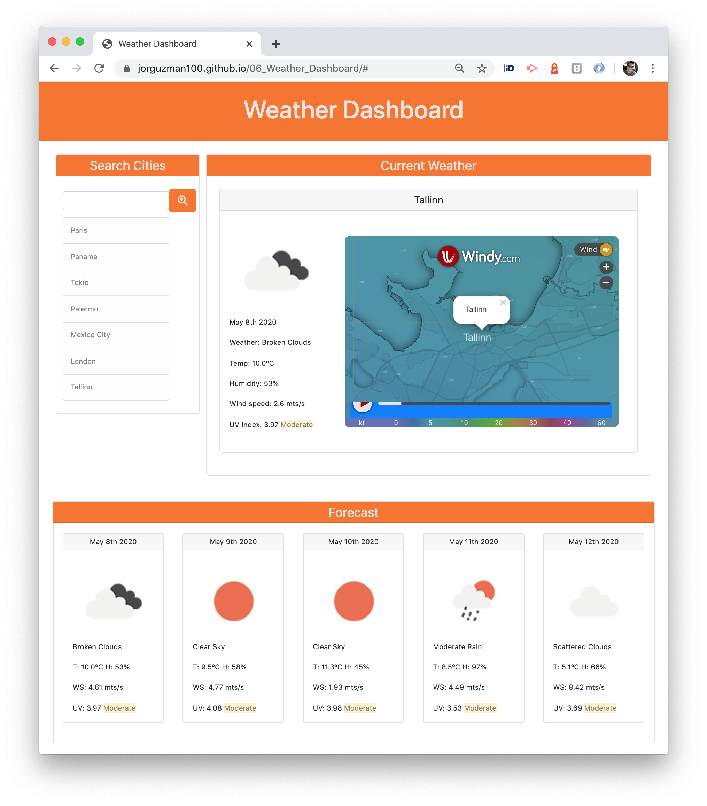

# 06_Weather_Dashboard

A weather dashboard application that allows the user to search for any city and obtain weather information, such as weather description, temperature, humidity, wind speed, UV index and more. \
Built with HTML, CSS, Bootstrap, JavaScript, jQuery, Moment.js, OpenWeather API, and Windy MAP API.

## The Challenge

To create a weather dashboard that will run in the browser and feature dynamically updated HTML and CSS.

Use the [OpenWeather API](https://openweathermap.org/api) to retrieve weather data for cities.

Main elements:

- [x] Cities search functionality.
- [x] History of cities searched, storaged locally in the browser.
- [x] Display current weather information.
- [x] Display forcast information for the next 5 days.
- [x] Display a Windy Map of the selected city.

## The development process

In order to accomplish the challenge, the following steps were executed:

1. Define the purpose, and plan the general idea of the application.
2. Understand the basic functionality of the OpenWeather API.
3. Research and understand how to retrieve a map with the Windy.com API.
4. Search for assets (weather dashboards references, icons, etc.)
5. Define and build the base layout and grid, considering two stages:
   - Mobile-first approach.
   - Responsive design for larger screen sizes.
6. Create search functionality.
7. Create current weather display functionality.
8. Create forecast weather display functionality.
9. Integrate the Windy Map.
10. Apply semantic HTML.
11. Asses valid HTML with W3C validator.
12. Benchmark the site with WebsiteGrader.
13. Final review and proper documentation.

## The Output

With the described process we were able to create a useful, efficient and responsive Weather Dashboard application that display current and 5 days forecast of the selected city.

**The application**

## Installation

The project was uploaded to [GitHub](https://github.com/) at the following repository:
[https://github.com/jorguzman100/06_Weather_Dashboard](https://github.com/jorguzman100/06_Weather_Dashboard)

You can access the deployed application with the GitHup Pages link:
[https://jorguzman100.github.io/06_Weather_Dashboard/](https://jorguzman100.github.io/06_Weather_Dashboard/)

## Tools and other References

[Bootstrap](https://getbootstrap.com/)

[Font Awesome](https://fontawesome.com/)

[Moment.js](https://momentjs.com/)

[OpenWeather](https://openweathermap.org/)

[Windy Map](https://www.windy.com/)

[Website Grader](https://website.grader.com/)

[Markup Validation Service](https://validator.w3.org/)
